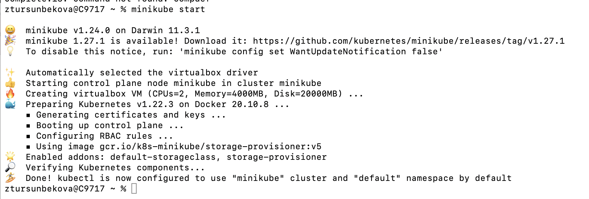
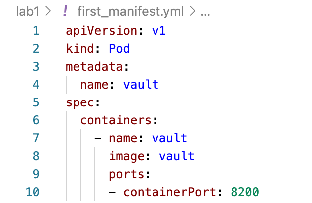
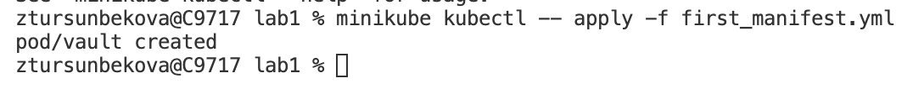
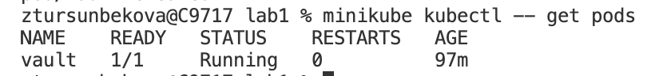
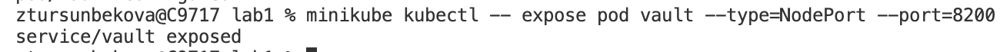
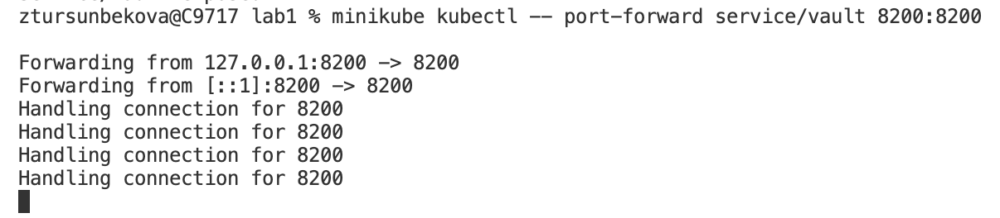
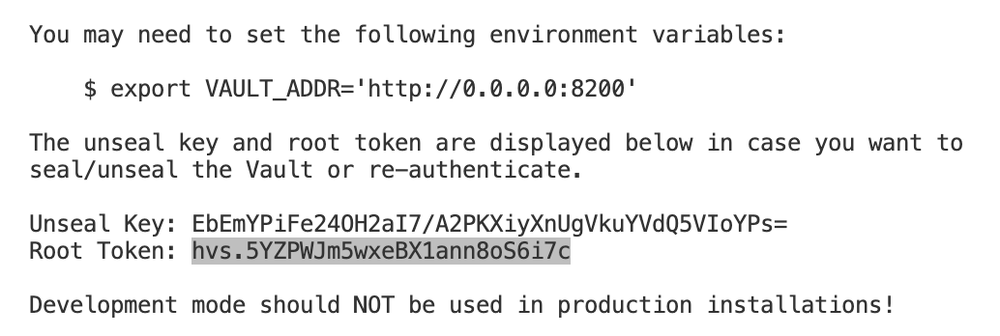
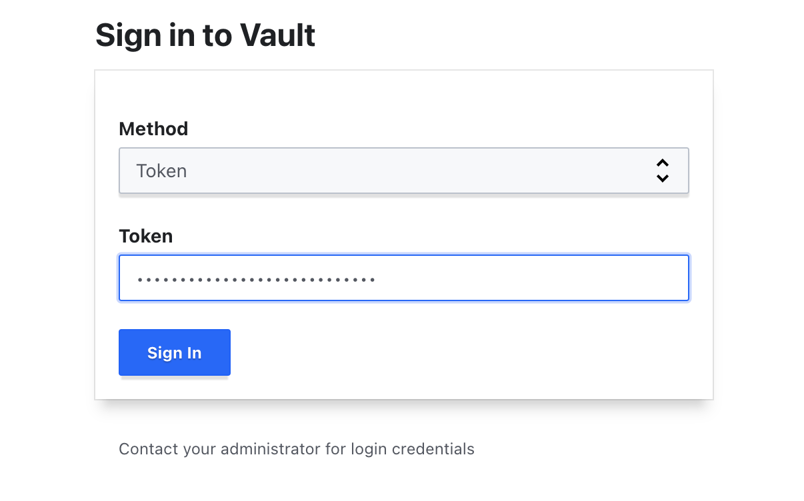
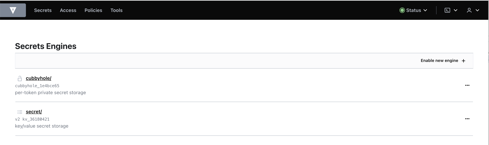

University: [ITMO University](https://itmo.ru/ru/)  
Faculty: [FICT](https://fict.itmo.ru)  
Course: [Introduction to distributed technologies](https://github.com/itmo-ict-faculty/introduction-to-distributed-technologies)  
Year: 2022/2023  
Group: K4110c  
Author: Tursunbekova Zhanna Khasanovna  
Lab: Lab1  
Date of create: 24.10.2022  
Date of finished: 27.10.2022  

# Name of lab: Installing Docker and Minikube, my first manifest

### 1. Docker and minikube were already installed on a device.

### 2. Starting minikube

### 3. Here is the manifest to create a pod HashiCorp Vault with the port 8200.

### 4. Applying the manifest 

### 5. Here is the result. The pod is running

### 6. Then creating the service to access the container

### 7. Minikube forward the port of the device to the container via command 

### 8. Finding the token to login to Vault in logs via command

### 9. Here is the token

### 10. Paste it into field in the UI

### 11. Here is the result. We logged in. 

