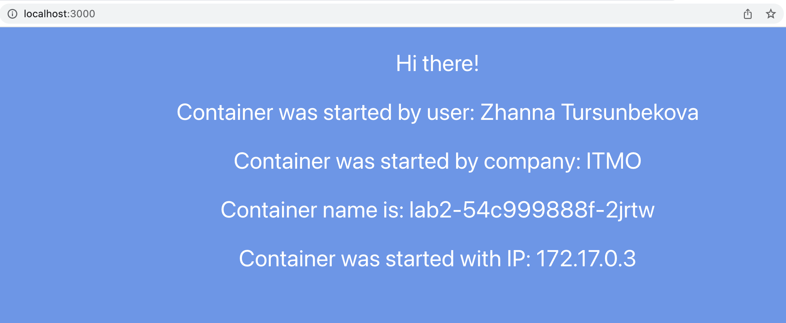

University: [ITMO University](https://itmo.ru/ru/)  
Faculty: [FICT](https://fict.itmo.ru)  
Course: [Introduction to distributed technologies](https://github.com/itmo-ict-faculty/introduction-to-distributed-technologies)  
Year: 2022/2023  
Group: K4110c  
Author: Tursunbekova Zhanna Khasanovna  
Lab: Lab2  
Date of create: ) 31.10.2022  
Date of finished: 03.11.2022  

# Name of lab: Deploying a web service in Minikube, accessing the web interface of the service. Service monitoring

### 1. Create a deployment with 2 replicas and pass variables to these replicas: REACT_APP_USERNAME, REACT_APP_COMPANY_NAME.

### 2.Creating the deployment. 

### 3. The result

### 4. Create a service to access to these pods.

### 5. Run port forwarding and connect to the containers through a web browser.

### 6. Check the web browser page for the REACT_APP_USERNAME, REACT_APP_COMPANY_NAME and Container name variables.

### 7. Check container logs, attach logs to the report.
#### First container 

#### Second container 

#### Logs of the service 

