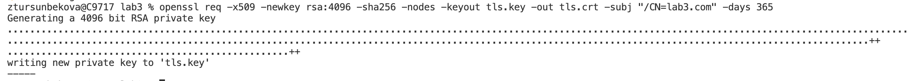

University: [ITMO University](https://itmo.ru/ru/)  
Faculty: [FICT](https://fict.itmo.ru)  
Course: [Introduction to distributed technologies](https://github.com/itmo-ict-faculty/introduction-to-distributed-technologies)  
Year: 2022/2023  
Group: K4110c  
Author: Tursunbekova Zhanna Khasanovna  
Lab: Lab3  
Date of create:   04.11.2022  
Date of finished: 05.11.2022  

# Name of lab: Certificates and Secrets in Minikube, secure data storage

### 1. Create configMap with variables: REACT_APP_ USERNAME, REACT_APP_ COMPANY NAME.

### 2. Result.

### 3. Create a replicaSet with 2 replicas and use configMap to pass the variables REACT_APP_USERNAME, REACT_APP_COMPANY_NAME.

### 4. Result.

### 5. Enable "minikube add-ons enable ingress" and generate TLS certificate, import certificate into minikube.

### 6. Create an ingress in minikube with certificate, FQDN and name of the service.
#### Service

#### Ingress

### 7. In hosts file, write the FQDN and IP address of your ingress and try to go to the FQDN name in the browser.

### 8. Log in to the web application with your FQDN using HTTPS and check the certificate.

