University: [ITMO University](https://itmo.ru/ru/)  
Faculty: [FICT](https://fict.itmo.ru)  
Course: [Introduction to distributed technologies](https://github.com/itmo-ict-faculty/introduction-to-distributed-technologies)  
Year: 2022/2023  
Group: K4110c  
Author: Tursunbekova Zhanna Khasanovna  
Lab: Lab4  
Date of create:   10.11.2022  
Date of finished: 19.11.2022  

# Name of lab: Networking in Minikube, CNI and CoreDNS

### 1. Starting minikube, install the CNI=calico plugin and the Multi-Node Clusters mode at the same time, for this lab you need to deploy 2 nodes.
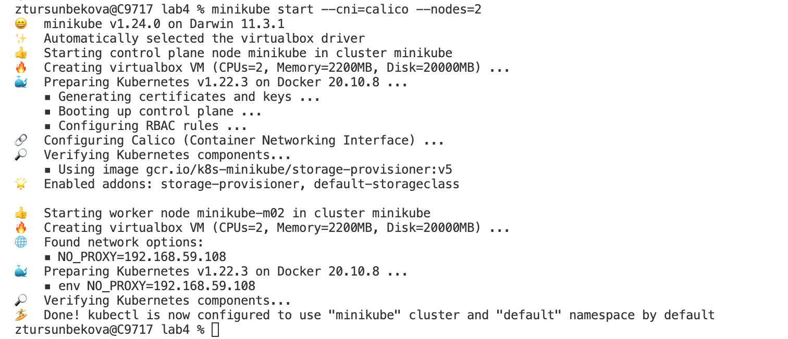

### 2. Check the operation of the Calico CNI plugin and the number of nodes, attach the results of the check to the report.
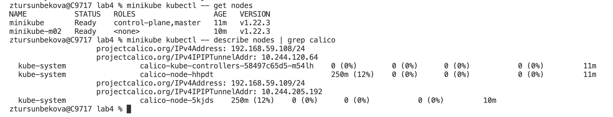

### 3. To test Calico's work, we will try one of the functions called IPAM Plugin. 
###    To check the IPAM mode, you need to specify a label for previously launched nodes based on a rack or geographic location (your choice).
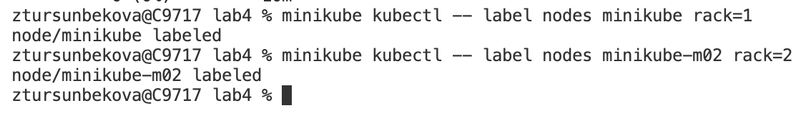

### 4. Develop a manifest for Calico that assign IP addresses to "pods" based on labels.
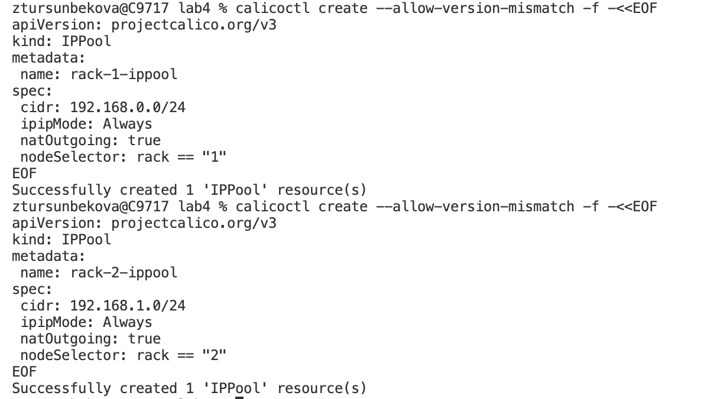

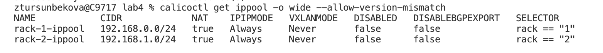

### 5. Create a deployment with 2 replicas and pass variables to these replicas: REACT_APP_USERNAME, REACT_APP_COMPANY_NAME.
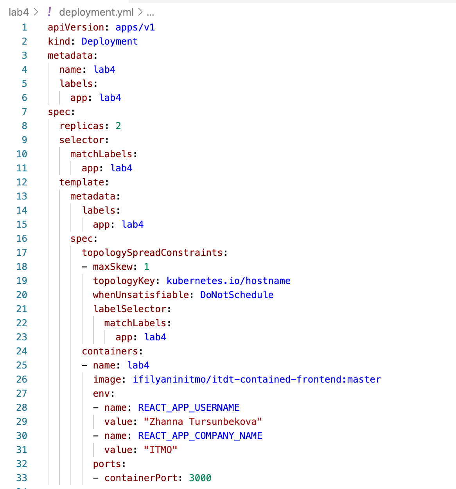

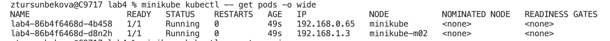

### 6. Create a service through which you will have access to these pods. The choice of service type is up to you.
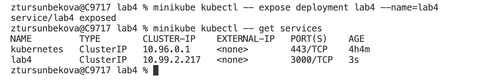

### 7. Run minikube in port forwarding mode and connect to your containers through a web browser.
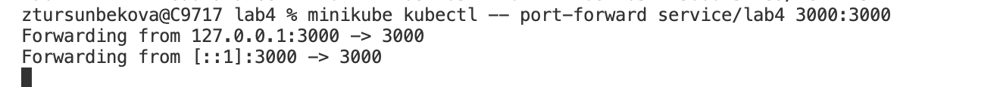

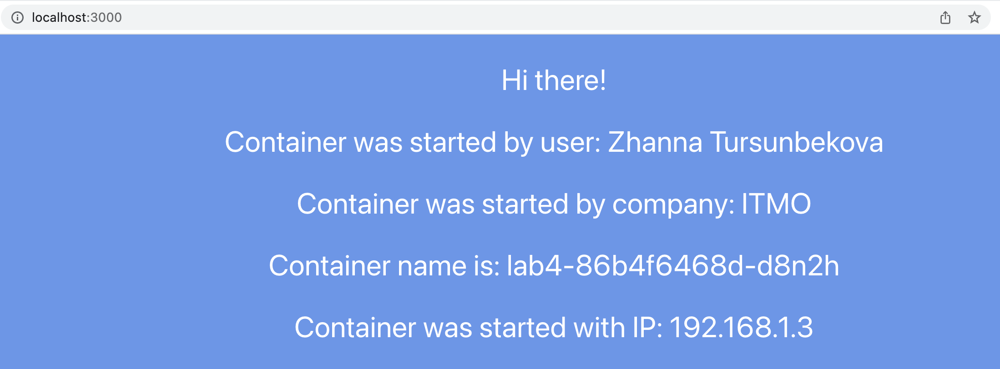

### 8. Using kubectl exec, go to any pod and try to ping the other pod, the results of the pings should be attached to the report.
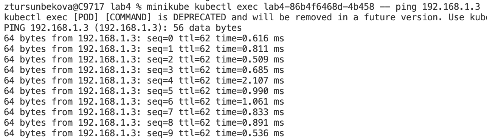
